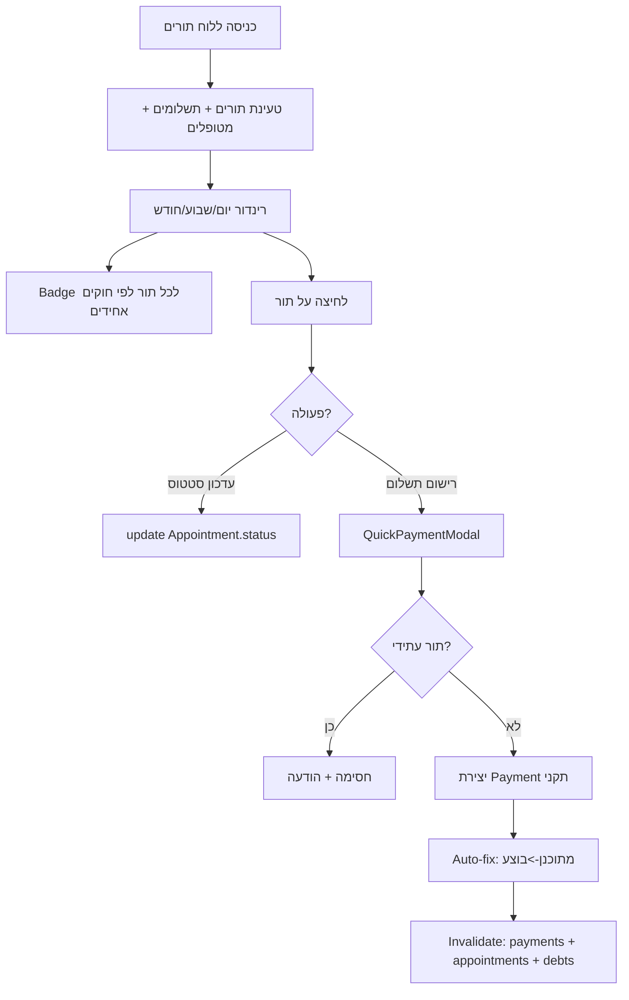
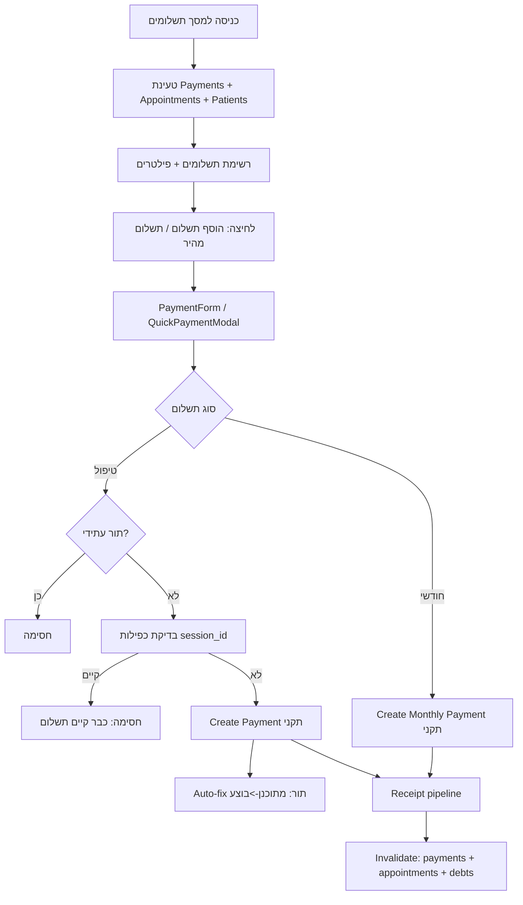
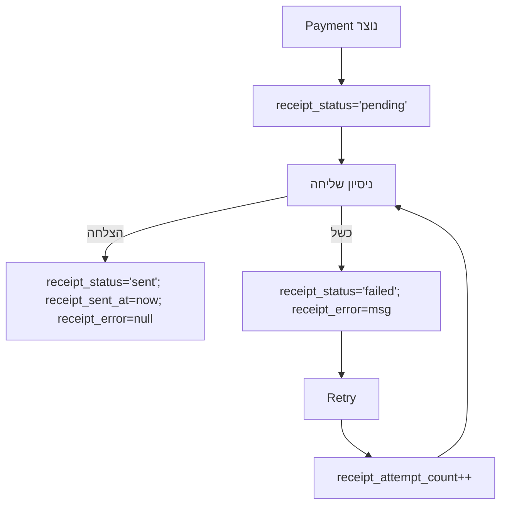

# Clinic Manager — APPLICATION_SPEC.md
> גרסה: 1.0 (מאוחדת לפי השיח והקוד בפרויקט)  
> שפה: עברית (RTL-friendly)  
> מטרת מסמך: אפיון מוצר + כללים מחייבים לקוד, עקבי בכל המסכים והזרימות.

---

## 0) תקציר מנהלים
Clinic Manager היא מערכת תפעולית לקליניקה שמאחדת **תורים, תשלומים, חובות והוצאות** בצורה שמפחיתה טעויות אנוש ומונעת מצבי סתירה בין מסכים.  
העיקרון המרכזי: **Single Source of Truth** לכל ישות + **חוקים אחידים** שמיושמים בכל המסכים.

**ארבעת המסכים החושבים:**
1. **לוח בקרה (Dashboard)** — תפעול יומי + חובות פתוחים בצורה חדה וברורה.
2. **לוח תורים (Calendar / Appointments)** — ניהול התורים והסטטוס התפעולי שלהם.
3. **תשלומים (Payments)** — רישום/היסטוריה/קבלות, סנכרון עם תורים ומניעת כפילויות.
4. **הוצאות (Expenses)** — רישום הוצאות וצירוף מסמכים.

**מטרות מוצר (מה נחשב “הצלחה”):**
- אין מצב שבו משתמש רואה “שולם” במסך אחד ו“לא שולם/חוב” במסך אחר לאותה ישות.
- אי אפשר להגיע למצב אסור: **שולם + תור נשאר מתוכנן** (מניעת סתירה תפעולית).
- לוגיקת “חודשי” היא אחת ויחידה בכל המערכת.
- הנתונים נשמרים יציבים: Payment הוא “תיעוד היסטורי” ולא משתנה בגלל חישובים עתידיים.

---

## 1) מונחים והגדרות
### 1.1 ישויות
- **Patient (מטופל)** — פרטי מטופל והגדרות חיוב.
- **Appointment (תור/טיפול)** — אירוע טיפולי בזמן.
- **Payment (תשלום)** — תיעוד תשלום (לטיפול בודד או חודשי).
- **Expense (הוצאה)** — הוצאה תפעולית/עסקית.
- **Attachment / Document (מסמך מצורף)** — קובץ המשויך לישות (תשלום/הוצאה/מטופל/תור).

### 1.2 Single Source of Truth — כללים מחייבים
1. **“שולם” נגזר רק מקיום Payment**  
   לא מסתמכים על status של התור כדי להחליט “שולם”.
2. **חוב נפתח לפי סיום בפועל של טיפול**  
   “סיום טיפול” = `date + time + duration` עברו את זמן “עכשיו”.
3. **“חודשי” מוגדר רק לפי `billing_model` במטופל**  
   אין הסתמכות על `payment_frequency` (אם קיים — הוא מיושן).
4. **Monthly Payment סוגר חודש (billing_month), לא טיפול**  
   תשלום טיפול בודד בתוך חודש חודשי מפחית טיפול מהחיוב החודשי — לא סוגר חודש.
5. **תשלום טיפול (session_id) לא יכול להיות על תור עתידי**  
   Payment עם `session_id` מייצג תשלום על טיפול שבוצע (או לכל הפחות הסתיים בזמן).
6. **מניעת כפילות קשיחה**  
   לכל `session_id` מותר Payment אחד בלבד.

---

## 2) מודל נתונים (Data Model) — טבלאות שדות

> הערה: השדות להלן הם אפיוניים. בקוד בפועל יכולים להיות שדות נוספים (metadata וכו’).  
> “חובה” = חייב להיות קיים בכל יצירה/עדכון רלוונטי.  
> “נגזר” = לא נשמר כאמת, אלא מחושב בזמן ריצה.

### 2.1 Patient
| שדה | טיפוס | חובה | דוגמה | הערות |
|---|---|---:|---|---|
| id | string | ✅ | pat_123 | מזהה ייחודי |
| name | string | ✅ | דנה לוי |  |
| billing_model | per_session \| monthly_aggregate | ✅ | monthly_aggregate | מקור אמת יחיד לחודשי/פר-טיפול |
| session_price | number | ✅ | 250 | מחיר נוכחי לחישובים עתידיים (לא משנה היסטוריה של תשלומים) |
| phone / email | string | ❌ |  | לצורך קבלות/הודעות אם יש |

**כלל:** אין להשתמש ב-`payment_frequency` לחישובים (אם קיים בקוד — להסב/להוציא מהלוגיקה).

---

### 2.2 Appointment
| שדה | טיפוס | חובה | דוגמה | הערות |
|---|---|---:|---|---|
| id | string | ✅ | apt_001 | מזהה תור |
| patient_id | string | ✅ | pat_123 | קשר למטופל |
| date | YYYY-MM-DD | ✅ | 2026-02-18 | חובה ללוגיקת זמן |
| time | HH:mm | ✅ | 14:30 | חובה ללוגיקת זמן |
| duration | minutes | ✅ | 45 | ברירת מחדל אם חסר: 45 (אפיוני) |
| status | מתוכנן/בוצע/בוטל/לא הגיע | ✅ | מתוכנן | סטטוס תפעולי בלבד |
| notes | string | ❌ |  |  |
| amount (optional) | number | ❌ | 250 | אם קיים, הוא “snapshot מחיר” לתור; האפיון לא דורש אותו |

---

### 2.3 Payment
יש **שני סוגי תשלום**: תשלום טיפול (per-session) ותשלום חודשי (monthly).

#### 2.3.1 שדות משותפים לכל Payment (חובה בכל יצירה)
| שדה | טיפוס | חובה | דוגמה | הערות |
|---|---|---:|---|---|
| id | string | ✅ | pay_789 |  |
| patient_id | string | ✅ | pat_123 |  |
| amount | number | ✅ | 250 | **סכום היסטורי** שלא משתנה |
| status | paid | ✅ | paid | תמיד paid (אין partial/refund ב-v1) |
| created_at | datetime | ✅/מערכתי |  | מערכת |
| receipt_status | pending/sent/failed | ✅ | pending | ניהול שליחת קבלה |
| receipt_attempt_count | number | ✅ | 0 |  |
| receipt_sent_at | datetime או null | ✅ | null |  |
| receipt_error | string או null | ✅ | null |  |

#### 2.3.2 תשלום טיפול (Per-session Payment)
| שדה | טיפוס | חובה | דוגמה | הערות |
|---|---|---:|---|---|
| session_id | string | ✅ | apt_001 | חייב לקשר לתור/טיפול |
| billing_month | null/undefined | ✅ (אסור) | null | **אסור** שיהיה קיים |

**כללים:**
- `session_id` ייחודי (אין שני תשלומים על אותו תור).
- אסור ליצור אם התור עתידי.

#### 2.3.3 תשלום חודשי (Monthly Payment)
| שדה | טיפוס | חובה | דוגמה | הערות |
|---|---|---:|---|---|
| billing_month | YYYY-MM | ✅ | 2026-01 | מזהה חודש חיוב |
| session_id | null/undefined | ✅ (אסור) | null | **אסור** שיהיה קיים |

**כללים:**
- תשלום חודשי סוגר חודש עבור המטופל (לא טיפולים בודדים).
- תשלום טיפול בתוך החודש מפחית טיפולים לחיוב החודשי (לא סוגר חודש).

---

### 2.4 Expense
| שדה | טיפוס | חובה | דוגמה | הערות |
|---|---|---:|---|---|
| id | string | ✅ | exp_333 |  |
| date | YYYY-MM-DD | ✅ | 2026-02-01 |  |
| amount | number | ✅ | 120.50 |  |
| category | string | ✅ | ציוד |  |
| vendor | string | ❌ | KSP |  |
| notes | string | ❌ |  |  |

---

### 2.5 Attachment / Document
| שדה | טיפוס | חובה | דוגמה | הערות |
|---|---|---:|---|---|
| id | string | ✅ | doc_12 |  |
| owner_type | payment/expense/patient/session/other | ✅ | expense | סוג ישות בעלים |
| owner_id | string | ✅ | exp_333 | מזהה הישות |
| file_type | pdf/jpg/png/webp | ✅ | pdf | whitelist |
| url/path | string | ✅ |  | מיקום הקובץ |
| created_at | datetime | ✅ |  |  |

---

## 3) כללים עסקיים (Business Rules)

### 3.1 סיום טיפול (הגדרת זמן)
טיפול “הסתיים” אם:
- יש `date` ו-`time`
- מחשבים `endTime = start + duration`
- `endTime <= now`

אם חסר date/time → אין חישוב “הסתיים” (המערכת לא קורסת).

---

### 3.2 מהו “שולם”
**שולם נגזר רק מתשלום**:
- Appointment נחשב שולם אם קיים Payment עם `session_id === appointment.id`.

---

### 3.3 סגירת חוב לפי סטטוס
Appointment לא נחשב כחוב אם:
- status הוא `בוטל` או `לא הגיע`
- או שיש Payment לטיפול (session_id)

---

### 3.4 חוב פר-טיפול (per_session)
Appointment הוא חוב אם:
- הסתיים בזמן (סעיף 3.1)
- אין Payment עם session_id
- status לא בוטל/לא הגיע
- המטופל `billing_model='per_session'`

---

### 3.5 חיוב חודשי (monthly_aggregate)
#### 3.5.1 אילו טיפולים נכללים בחודש
נכללים טיפולים שהסתיימו בתוך החודש, ושהסטטוס שלהם **לא**:
- `בוטל`
- `לא הגיע`

כולל תורים שנשארו “מתוכנן” אך עברו בזמן (כי בפועל הסתיימו לפי זמן).

#### 3.5.2 איך מחושב סכום חודשי (כאשר אין Monthly Payment)
- `total_sessions` = כל הטיפולים הנכללים בחודש
- `paid_sessions` = טיפולים בחודש שיש להם Payment עם session_id
- `billable_sessions = total_sessions - paid_sessions`
- `amount_due = billable_sessions * patient.session_price`

> `patient.session_price` הוא מחיר נוכחי לחישובי חיוב.  
> Payment שנוצר נשאר היסטורי (amount לא משתנה).

#### 3.5.3 מתי חודש הופך לחוב
חוב חודשי עבור חודש X נפתח רק החל מ-**היום הראשון של החודש הבא** (X+1), אם אין Monthly Payment עם `billing_month = X`.

#### 3.5.4 איך נסגר חוב חודשי
נסגר רק ע"י Monthly Payment עם `billing_month` תואם.

---

### 3.6 מניעת כפילות תשלום
- לכל `session_id` מותר תשלום אחד בלבד.
- ניסיון ליצור תשלום נוסף לאותו session_id נחסם עם הודעה.

---

### 3.7 מניעת “שולם + מתוכנן”
לאחר יצירת Payment עם `session_id`:
- אם appointment.status היה `מתוכנן` → לעדכן ל-`בוצע`

זה “auto-fix” תפעולי שמונע מצב אסור.

---

## 4) מצבי UI (צבעים/תגים) — אחיד בכל המסכים

### 4.1 מפתח צבעים
- 🟩 **ירוק** — שולם
- 🟥 **אדום** — חוב פתוח
- 🟨 **צהוב** — מטופל חודשי “ממתין” (במהלך החודש/לפני יצירת חוב חודשי)
- ⚪ **אפור** — בוטל / לא הגיע / לא רלוונטי

### 4.2 כללי צבע/Badge עבור Appointment
1. **שולם (ירוק):** אם קיים Payment עם `session_id === apt.id`
2. **בוטל/לא הגיע (אפור):** אם status בוטל/לא הגיע
3. **חוב (אדום):** אם apt הסתיים בזמן, לא שולם, לא בוטל/לא הגיע, ו-`billing_model='per_session'`
4. **ממתין חודשי (צהוב):** אם apt הסתיים בזמן, לא שולם, לא בוטל/לא הגיע, ו-`billing_model='monthly_aggregate'`

### 4.3 צבע/Badge עבור חודש חודשי (Monthly)
- אם יש Monthly Payment עבור billing_month → 🟩 “שולם חודש”
- אם עבר החודש ואין Monthly Payment → 🟥 “חוב חודשי”
- אם בתוך החודש הנוכחי → 🟨 “ממתין” (לא חוב)

---

## 5) אפיון לפי מסכים (Dashboard / Calendar / Payments / Expenses)

---

### 5.1 Dashboard — לוח בקרה
**מטרות**
- תפעול יומי מהיר
- הצגת חובות פתוחים בצורה אחת (ללא כפילות חישובים)
- זרימות תשלום קצרות שמייצרות נתונים תקניים

**רכיבים חובה**
1) **TodayAppointments (תפעול יומי)**  
   - מציג תורים (לרוב היום; לפי מה שקיים בקוד)  
   - לכל תור מציג badge לפי סעיף 4.2  
   - פעולות:
     - “רישום תשלום” (פותח QuickPaymentModal)
     - “בוטל/לא הגיע/בוצע” (סטטוס תפעולי)

2) **Open Debts (חובות פתוחים)**  
   - רשימה אחת שמציגה:
     - חובות פר-טיפול (per_session)
     - חובות חודשיים (אחרי סוף חודש)
   - כולל אפשרות לפתיחת “פרטי חוב” ואז רישום תשלום

**כפילות רכיבים**
- `UnpaidSessionsTracker` לא יופיע כחלק תפעולי ראשי.  
  אם נשמר — יהיה תחת “מידע נוסף” (details/accordion) או במסך נפרד.

**Flow — Dashboard**
```mermaid
flowchart TD
  A[כניסה לדשבורד] --> B[טעינת Appointments + Payments + Patients]
  B --> C[TodayAppointments מציג תורים]
  C --> D{תור שולם? (Payment.session_id)}
  D -->|כן| E[Badge ירוק: שולם]
  D -->|לא| F{סטטוס בוטל/לא הגיע?}
  F -->|כן| G[Badge אפור: סגור]
  F -->|לא| H{הטיפול הסתיים בזמן?}
  H -->|לא| I[Badge לפי סטטוס תפעולי]
  H -->|כן| J{billing_model}
  J -->|per_session| K[Badge אדום: חוב]
  J -->|monthly_aggregate| L[Badge צהוב: ממתין חודשי]

  C --> M[לחיצה: רישום תשלום]
  M --> N[QuickPaymentModal]
  N --> O{תשלום טיפול או חודשי?}
  O -->|טיפול| P[Create Payment עם session_id]
  O -->|חודשי| Q[Create Monthly Payment עם billing_month]
  P --> R[Auto-fix: אם מתוכנן -> בוצע]
  P --> S[Receipt: pending -> sent/failed]
  Q --> S
  S --> T[Invalidate: payments + appointments + debts]
```

---

### 5.2 Calendar — לוח תורים
**מטרות**
- ניהול התורים והסטטוס התפעולי
- הצגת אינדיקציה פיננסית עקבית (שולם/חוב/ממתין)
- חסימה של תשלום על תור עתידי (בתשלום טיפול)

**התנהגויות חובה**
- badge לכל תור לפי סעיף 4.2
- שינוי status הוא תפעולי בלבד
- Payment עם session_id חסום לתור עתידי

**Flow — Calendar**


---

### 5.3 Payments — תשלומים
**מטרות**
- מקור אמת לתשלומים
- אחידות יצירת Payment (כולל receipt fields)
- סנכרון מול תור (auto-fix)
- מניעת כפילות `session_id`
- ניהול קבלות (status + retry)

**Flow — Payments**


---

### 5.4 Expenses — הוצאות
**מטרות**
- רישום הוצאות
- פילטרים בסיסיים
- צירוף מסמכים

**Flow — Expenses**
```mermaid
flowchart TD
  A[כניסה למסך הוצאות] --> B[טעינת Expenses + Attachments]
  B --> C[רשימת הוצאות + פילטרים]
  C --> D[הוספת הוצאה]
  D --> E[שמירה DB]
  E --> F[צירוף מסמכים (אופציונלי)]
  F --> G[Invalidate: expenses + attachments]
```

---

## 6) התממשקויות קיימות (Integrations)

### 6.1 Receipt Sending (שליחת קבלות)
**Flow**


### 6.2 Document Upload / Attachments
- owner_type: payment/expense/patient/session/other
- סוגים מותרים: pdf/jpg/png/webp
- בדיקת סיומת + magic bytes + rate limit + whitelist בשירות
- cascade delete לפי owner

### 6.3 Routing
- כל ה-URLs lowercase
- Links ו-Routes חייבים להיות מנורמלים יחד (case-sensitive environments)

### 6.4 SMS / Notifications (אופציונלי)
- מופרד מהלוגיקה הפיננסית
- נשען על Appointments בלבד

---

## 7) נספח תסריטים (15)
> כל תסריט: מצב → פעולה → תוצאה צפויה בכל המסכים.

1) תשלום על תור שהיה מתוכנן → Payment תקני + auto-fix מתוכנן→בוצע + ירוק בכל מקום  
2) תור הסתיים, נשאר מתוכנן, per_session, אין תשלום → אדום חוב בכל מקום  
3) תור הסתיים, status לא הגיע → אפור, לא חוב  
4) תשלום על תור עתידי → חסימה  
5) כפילות תשלום לאותו session_id → חסימה  
6) מטופל חודשי, בתוך החודש, טיפול הסתיים ואין תשלום → צהוב “ממתין”  
7) חודש עבר ואין Monthly Payment → חוב חודשי אדום  
8) חודשי: שילם טיפול אחד בתוך החודש → מפחית טיפולים לחיוב החודשי  
9) חודשי: Monthly Payment סוגר חודש → ירוק “שולם חודש”  
10) כשל קבלה → receipt failed אך שולם נשאר ירוק  
11) date/time חסרים → לא קריסה, לא חישובי חוב  
12) שינוי status לבוטל אחרי שהיה חוב → נסגר (אפור)  
13) שינוי session_price לא משנה payments קיימים → payments נשארים היסטוריים  
14) routing lowercase עובד בכל סביבה → אין שבירות ניווט  
15) הוצאה + מסמך → נשמרת, attachment תקין

---

## 8) Checklist לפיתוח
- נקודת אמת ליצירת Payment: defaults + guards + כפילות + auto-fix  
- badges אחידים לפי כללים (לא תלויי מסך)  
- חודשי = billing_model בלבד, monthly payment = billing_month בלבד  
- חסימת תשלום טיפול על עתיד  
- guards ל-date/time  
- invalidate מינימלי  
- routing lowercase

---

**סוף מסמך**
